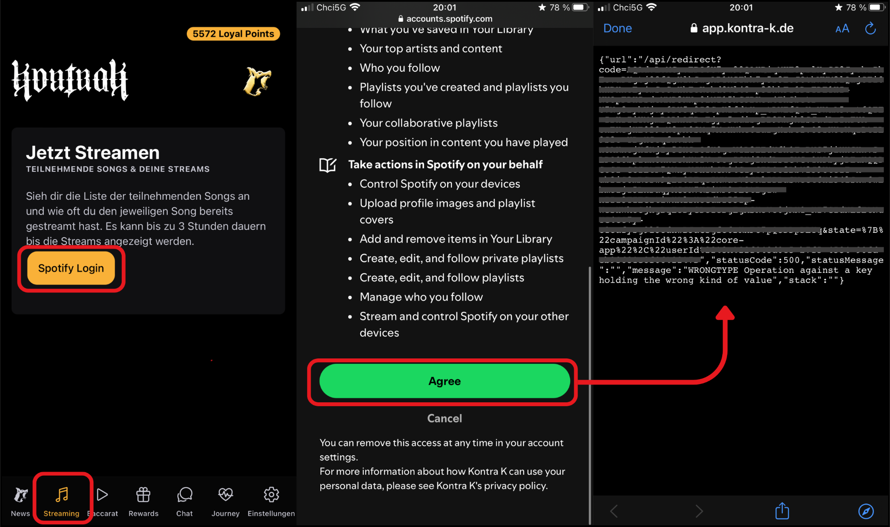

## 🐞 Bug Report

**ID: KontraK_APP-001**

**Title: Users are unable to link their Spotify accounts**

**Severity**: Medium

**Priority**: High


📌 **Description**

Users are unable to link their Spotify accounts. This prevents them from accessing Spotify features within the application. API request to /api/redirect returns 500 error.


🎯 **Steps to Reproduce**

1. Launch the Kontra K app and log in
2. Tap the Streaming button
3. Tap Spotify login
4. Browser window opens, log into Spotify → tap Agree
5. Observe the error message returned from API


✅ **Expected Result**

After granting Spotify permissions, the app should successfully redirect and link their Spotify account.


❌ **Actual Result**

The app displays the following API response (sensitive identifiers masked for security reasons):  
```
{
  "url": "/api/redirect?code=***&state={\"campaignId\":\"core-app\",\"userId\":\"***\"}",
  "statusCode": 500,
  "statusMessage": "",
  "message": "WRONGTYPE Operation against a key holding the wrong kind of value",
  "stack": ""
}
```

📱 **Environment**

Device: iPhone 8 plus

OS: iOS Version 16.7.11

App Version: 1.4


🔎 **Attachment**
Screenshot (with identifiers redacted).


